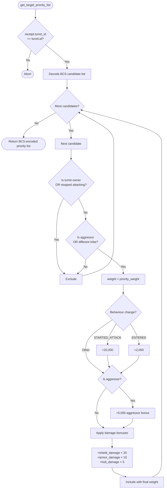

# Turret Aggressor First

Standalone smart turret strategy package for the `aggressor_first` behavior.

Witness type:

- `<PACKAGE_ID>::aggressor_first::TurretAuth`

Behavior:

- prioritizes active aggressors
- keeps hostile off-tribe targets eligible
- adds extra weight for damaged targets so the turret tends to finish fights

## Flowchart



Build and test:

```bash
cd move-contracts/turret_aggressor_first
sui move build -e testnet
sui move test
```
