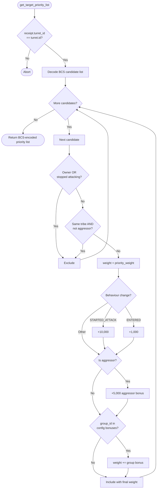

# Turret Group Specialist

Standalone smart turret strategy package for the `group_specialist` behavior.

Witness type:

- `<PACKAGE_ID>::group_specialist::TurretAuth`

Behavior:

- owner maintains an on-chain `GroupSpecialistConfig` mapping `group_id → weight_bonus`
- each candidate's `group_id` is looked up in the config; a matching entry adds its bonus to the weight
- intended for weapon-class alignment — e.g. an Autocannon turret should have large bonuses for Shuttles (31) and Corvettes (237); a Howitzer for Cruisers (26) and Combat Battlecruisers (419)
- standard aggressor/tribe/owner exclusions still apply

## Configuration Functions

| Function | Description |
|---|---|
| `create_config(turret, owner_cap, ctx)` | Creates and shares an empty specialisation config |
| `set_group_bonus(config, turret, owner_cap, group_id, bonus)` | Adds or replaces a bonus for a group_id |
| `remove_group_bonus(config, turret, owner_cap, group_id)` | Removes a bonus entry |
| `group_bonuses(config)` | Read-only view of all entries |

## Flowchart



Build and test:

```bash
cd extensions/turret_group_specialist
sui move build
sui move test
```
