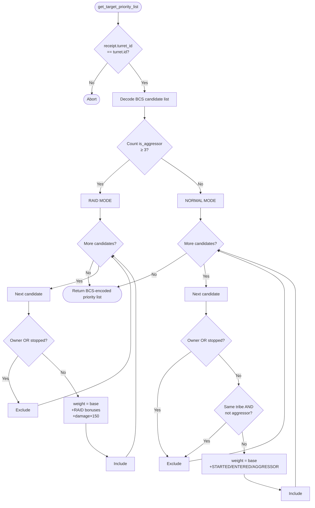

# Turret Last Stand

Standalone smart turret strategy package for the `last_stand` behavior.

Witness type:

- `<PACKAGE_ID>::last_stand::TurretAuth`

Behavior:

- counts the number of active aggressors in each candidate list at call time
- if **< 3** aggressors: **Normal mode** — standard tribe/owner exclusions, modest bonuses
- if **≥ 3** aggressors: **Raid mode** — tribe exclusion is lifted (all non-owner hostiles are eligible), massive aggressor and damage-scaling bonuses apply to finish wounded targets fast
- the mode resets automatically each call based on the live candidate list — no persistent state required

| Constant | Normal | Raid |
|---|---|---|
| `STARTED_ATTACK` bonus | 10,000 | 30,000 |
| `AGGRESSOR` bonus | 5,000 | 20,000 |
| `ENTERED` bonus | 1,000 | 500 |
| Damage multiplier | — | 150 × combined damage % |
| Tribe exclusion | Yes | No (same-tribe included) |

## Flowchart



Build and test:

```bash
cd extensions/turret_last_stand
sui move build
sui move test
```
