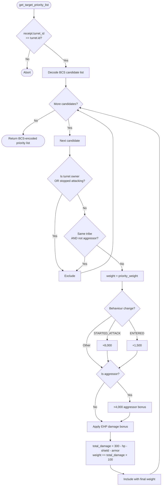

# Turret Low HP Finisher

Standalone smart turret strategy package for the `low_hp_finisher` behavior.

Witness type:

- `<PACKAGE_ID>::low_hp_finisher::TurretAuth`

Behavior:

- excludes owner and same-tribe non-aggressors
- favors already damaged hostile targets
- still rewards active aggression and attack starts

## Flowchart



Build and test:

```bash
cd move-contracts/turret_low_hp_finisher
sui move build -e testnet
sui move test
```
