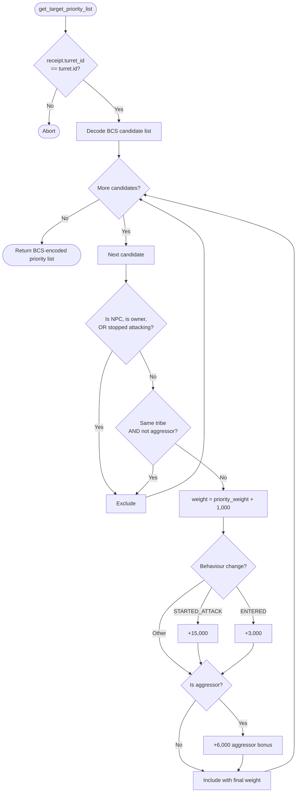

# Turret Player Screen

Standalone smart turret strategy package for the `player_screen` behavior.

Witness type:

- `<PACKAGE_ID>::player_screen::TurretAuth`

Behavior:

- ignores NPC candidates
- ignores same-tribe non-aggressors
- boosts player attackers and entered-range hostile pilots

## Flowchart



Build and test:

```bash
cd move-contracts/turret_player_screen
sui move build -e testnet
sui move test
```
