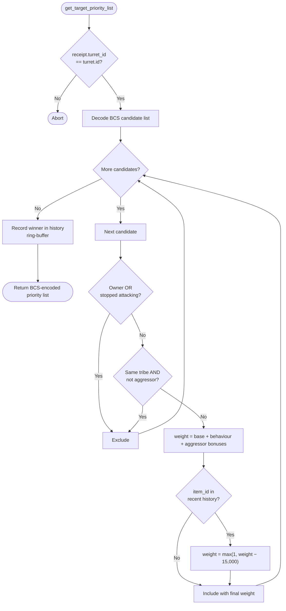

# Turret Round Robin

Standalone smart turret strategy package for the `round_robin` behavior.

Witness type:

- `<PACKAGE_ID>::round_robin::TurretAuth`

Behavior:

- maintains a mutable on-chain `RoundRobinConfig` tracking the `item_id`s of recently targeted ships in a bounded ring-buffer
- any candidate whose `item_id` appears in the history receives a `−15,000` weight penalty (floored at 1 so it stays in the list)
- after each call the highest-weight candidate (likely the next target) is recorded in the history
- once the buffer reaches `history_max_size`, the oldest entry is evicted

Use this strategy to spread fire across multiple attackers rather than permanently focusing a single ship.

## Configuration Functions

| Function | Description |
|---|---|
| `create_config(turret, owner_cap, history_max_size, ctx)` | Creates and shares a new history config |
| `reset_history(config, turret, owner_cap)` | Clears the target history |
| `history(config)` | Read-only view of current history |

## Flowchart



Build and test:

```bash
cd extensions/turret_round_robin
sui move build
sui move test
```
