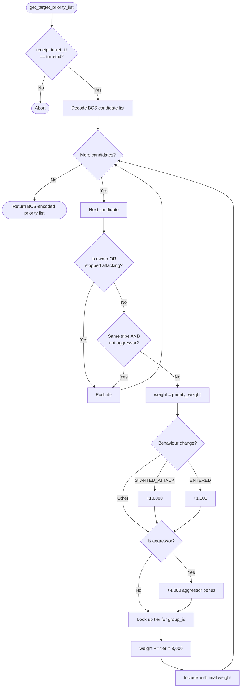

# Turret Size Priority

Standalone smart turret strategy package for the `size_priority` behavior.

Witness type:

- `<PACKAGE_ID>::size_priority::TurretAuth`

Behavior:

- assigns each candidate a hull-size tier based on `group_id` (Shuttle=1 … Combat Battlecruiser=6)
- adds a flat bonus of `tier × 3,000` to the base weight
- larger ships are prioritised when combat intensity is equal
- active aggressors and attack-start events still override pure size — a frigate that starts attacking outweighs a battlecruiser that merely entered range

| Hull class | group_id | Tier | Tier bonus |
|---|---|---|---|
| Shuttle | 31 | 1 | 3,000 |
| Corvette | 237 | 2 | 6,000 |
| Frigate | 25 | 3 | 9,000 |
| Destroyer | 420 | 4 | 12,000 |
| Cruiser | 26 | 5 | 15,000 |
| Combat Battlecruiser | 419 | 6 | 18,000 |

## Flowchart



Build and test:

```bash
cd extensions/turret_size_priority
sui move build
sui move test
```
