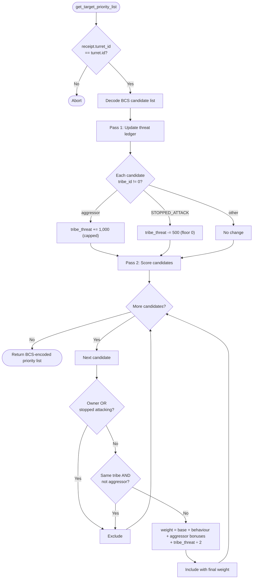

# Turret Threat Ledger

Standalone smart turret strategy package for the `threat_ledger` behavior.

Witness type:

- `<PACKAGE_ID>::threat_ledger::TurretAuth`

Behavior:

- maintains a persistent on-chain `Table<tribe_id, threat_score>` inside a shared `ThreatLedgerConfig`
- each targeting call first updates the ledger: aggressors increment their tribe's threat by `+1,000`; `STOPPED_ATTACK` decrements by `−500` (forgiveness)
- tribe threat is capped at `max_threat` (default 20,000) to prevent unbounded accumulation
- the weight bonus applied to each candidate equals `tribe_threat ÷ 2`
- tribes that consistently aggress face escalating weight bonuses; de-escalation gradually reduces them
- tribe_id `0` (NPCs) is ignored and never written to the ledger

## Configuration Functions

| Function | Description |
|---|---|
| `create_config(turret, owner_cap, max_threat, ctx)` | Creates and shares a new threat ledger |
| `pardon_tribe(config, turret, owner_cap, tribe_id)` | Resets a tribe's threat to zero |
| `tribe_threat(config, tribe_id)` | Read-only view of a tribe's current threat score |

## Flowchart



Build and test:

```bash
cd extensions/turret_threat_ledger
sui move build
sui move test
```
