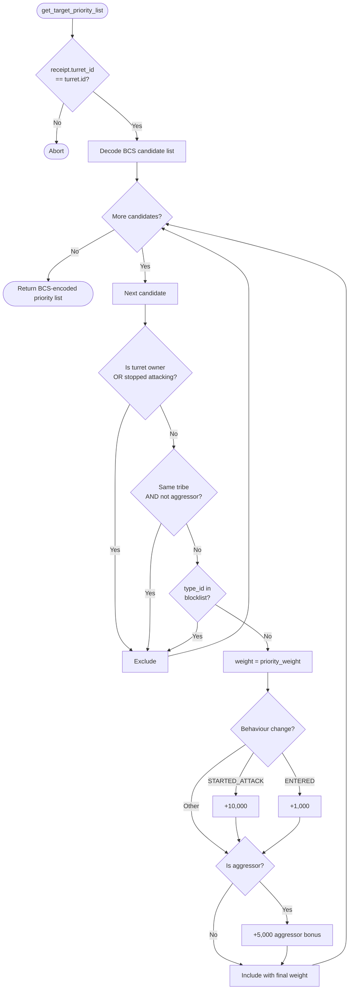

# Turret Type Blocklist

Standalone smart turret strategy package for the `type_blocklist` behavior.

Witness type:

- `<PACKAGE_ID>::type_blocklist::TurretAuth`

Behavior:

- excludes any candidate whose `type_id` appears in the owner-configured blocklist
- excludes the turret owner and same-tribe non-aggressors
- excludes candidates that stopped attacking
- applies standard aggression-based scoring to all remaining candidates

## Configuration Object

The owner deploys a shared `TypeBlocklistConfig` object alongside the turret and passes it into every targeting call. The list can be updated at any time using `OwnerCap<Turret>`:

| Function | Description |
|---|---|
| `create_config(turret, owner_cap, ctx)` | Creates and shares a new empty blocklist |
| `add_blocked_type(config, turret, owner_cap, type_id)` | Adds a type_id to the blocklist |
| `remove_blocked_type(config, turret, owner_cap, type_id)` | Removes a type_id from the blocklist |
| `blocked_type_ids(config)` | Read-only view of current blocked type_ids |

Common ship `type_id` values (from the extension example comments):

| Ship class | type_id |
|---|---|
| Shuttle | 31 |
| Corvette | 237 |
| Frigate | 25 |
| Destroyer | 420 |
| Cruiser | 26 |
| Combat Battlecruiser | 419 |

## Flowchart



Build and test:

```bash
cd extensions/turret_type_blocklist
sui move build
sui move test
```
